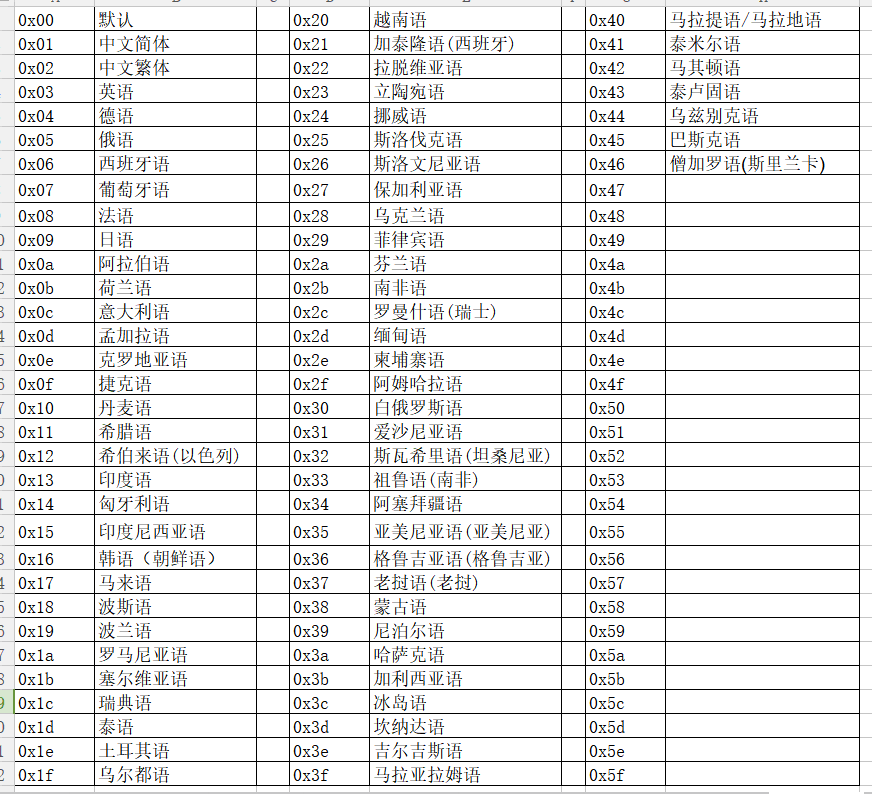

# FitCloudPro-SDK-Android集成文档

该文档为指导Android开发人员在Android 4.4及以上系统中集成FitCloudPro-SDK-Android，主要为一些关键的使用示例，更详细API，请参考JavaDoc文档。

## 一、导入SDK
将`libraryCore_vx.x.x.aar`和`libraryDfu_vx.x.x.aar`导入工程，一般复制到libs目录下，然后在module中的build.gradle中如下设置：
```
repositories {
    flatDir {
        dirs 'libs'
    }
}

dependencies {
    ...

    //RxJava2 and RxAndroid
    implementation 'io.reactivex.rxjava2:rxjava:2.2.19'
    implementation 'io.reactivex.rxjava2:rxandroid:2.1.1'

    //RxAndroidBle
    implementation 'com.polidea.rxandroidble2:rxandroidble:1.11.0'

    //lib core function
    implementation(name: 'libraryCore_v1.0.4', ext: 'aar')

    //lib dfu function. Optional. If your app need dfu function.
    implementation(name: 'libraryDfu_v1.0.1', ext: 'aar')
    
    ...
}

```

## 二、权限设置

```
<!--In most cases, you need to ensure that the device supports BLE.-->
<uses-feature
    android:name="android.hardware.bluetooth_le"
    android:required="true"/>

<uses-permission android:name="android.permission.BLUETOOTH"/>
<uses-permission android:name="android.permission.BLUETOOTH_ADMIN"/>

<!--Android 6.0 and above. Bluetooth scanning requires one of the following two permissions. You need to apply at run time.-->
<uses-permission android:name="android.permission.ACCESS_COARSE_LOCATION"/>
<uses-permission android:name="android.permission.ACCESS_FINE_LOCATION"/>

<!--Optional. If your app need dfu function.-->
<uses-permission android:name="android.permission.INTERNET"/>
```

## 三、初始化

你可以直接让你自己的`Application`类继承`WristbandApplication`

```
public class MyApplication extends WristbandApplication {
    @Override
    public void onCreate() {
        super.onCreate();
        WristbandApplication.setDebugEnable(true);
    }
}

```
或者在`onCreate`方法中初始化它。

```
public class MyApplication extends Application {
    @Override
    public void onCreate() {
        super.onCreate();
        WristbandApplication.init(this);
        WristbandApplication.setDebugEnable(true);
    }
}
```

## 四、扫描设备

你可以使用系统自带API扫描蓝牙设备，也可以和示例中一样，使用[RxAndroidBle](https://github.com/Polidea/RxAndroidBle)扫描设备。使用系统API请参考Android开发手册，使用RxAndroidBle如下，具体请参考[RxAndroidBle](https://github.com/Polidea/RxAndroidBle)或者sample工程：

```
//不要自己创建RxBleClient实例，请如下获取。
RxBleClient mRxBleClient = WristbandApplication.getRxBleClient();

ScanSettings scanSettings = new ScanSettings.Builder()
.setScanMode(ScanSettings.SCAN_MODE_LOW_LATENCY)
.setCallbackType(ScanSettings.CALLBACK_TYPE_ALL_MATCHES).build();
                            
Disposable mScanDisposable = mRxBleClient.scanBleDevices(scanSettings)
                            .subscribe(new Consumer<ScanResult>() {
                                @Override
                                public void accept(ScanResult scanResult) throws Exception {
                                    mAdapter.add(scanResult);
                                }
                            }, new Consumer<Throwable>() {
                                @Override
                                public void accept(Throwable throwable) throws Exception {
                                    stopScanning();
                                }
                            });
                            
```

## 五、连接设备

与手环连接相关的API如下，详情参考JavaDoc中WristbandManager类，具体使用参考sample工程。

```
void connect(@NonNull String address, @NonNull String userIdentity, boolean bindOrLogin,
                 boolean sex, int age, float height, float weight);

void connect(@NonNull BluetoothDevice device, @NonNull String userIdentity, boolean bindOrLogin
            , boolean sex, int age, float height, float weight);

void connect(@NonNull RxBleDevice device, @NonNull String userIdentity, boolean bindOrLogin
            , boolean sex, int age, float height, float weight);

void close();

Observable<ConnectionState> observerConnectionState();

Observable<ConnectionError> observerConnectionError();

boolean isConnected();

boolean isBindOrLogin();

WristbandConfig getWristbandConfig();

RxBleDevice getRxBleDevice();

String getConnectedAddress();

BluetoothDevice getConnectedDevice();
```

使用`connect`方法连接手环，使用`close`方法断开连接，使用`observerConnectionState`方法监听连接的状态，使用`observerConnectionError`方法监听连接过程中的异常，以便于进行额外的处理和问题排查。使用`isConnected`方法判断连接是否已经建立。

连接成功后，可以使用`isBindOrLogin`方法判断此次连接是使用绑定模式还是登陆模式。使用`getWristbandConfig`方法可以获取手环的配置信息。

使用`getRxBleDevice`,`getConnectedAddress`,`getConnectedDevice`可以获取正在连接或者已经连接的设备。


> 注意：connect方法中参数isBindOrLogin, 即选择连接手环时，是使用绑定模式，还是登陆模式。绑定和登录两者有一些差别，对于一个新的用户，第一次连接手环时，你需要选择绑定操作。绑定成功之后，下一次连接手环时，你需要选择登录操作。

> 如果手环当前绑定的用户ID是1000，那么当你尝试使用ID为1001的用户进行登录时，登录会失败。某个用户是否绑定过，SDK内部并没有记录，你需要自己去处理这个逻辑。

> 如果当前绑定的用户ID为1000，尝试使用用户ID为1001重新绑定，仍然可以绑定成功。每次绑定成功，手环将清除之前的用户数据，包括运动、睡眠、心率等所有数据。

## 六、手环功能和对应API介绍

### 6.1、手环配置

在SDK中，`WristbandConfig`作为手环配置信息的实体类，里面包含了手环所有的配置信息和功能参数。在手环连接成功后，使用`WristbandManager#getWristbandConfig()`获取缓存的配置信息，也可以使用`WristbandManager#requestWristbandConfig()`重新请求手环获取。`WristbandConfig`包含以下信息：

1. WristbandVersion 固件信息
2. NotificationConfig 通知配置
3. BloodPressureConfig 血压配置
4. DrinkWaterConfig 喝水提醒配置
5. FunctionConfig 辅助功能配置
6. HealthyConfig 健康数据的实时检测配置
7. SedentaryConfig 久坐提醒配置
8. PageConfig 手环页面配置
9. TurnWristLightingConfig 翻腕亮屏配置
10. WarnHeartRateConfig 心率预警配置
11. WarnBloodPressureConfig 血压预警配置
12. NotDisturbConfig 免打扰配置

在获取到`WristbandConfig`之后，你可以在通过`WristbandConfig#getBytes()`获取对应的字节码，缓存到本地。之后可以通过`WristbandConfig#newInstance(byte[])`重新生成实例。

如果想要获取`WristbandConfig`中某一项配置的字节码，同样可以使用该项配置的`getBytes()`方法，如`PageConfig#getBytes()`.

#### 6.1.1、WristbandVersion
WristbandVersion里的信息主要分为三部分：

1.硬件、固件、flash等版本信息，用于以后固件升级时的版本判断。

```
private String project;
private String hardware;
private String patch;
private String flash;
private String app;
private String serial;
private String extension;
```

2.功能模块信息，用于判断手环所支持的功能。

部分功能模块的兼容在sdk内部已经处理，哪些需要外部使用时注意请参考各个功能模块的详细文档。

```
private boolean heartRateEnable;
private boolean oxygenEnabled;
private boolean bloodPressureEnabled;
private boolean respiratoryRateEnabled;
private boolean weatherEnabled;
private boolean ecgEnabled;
private boolean sportEnabled;
private boolean wechatSportEnabled;
private boolean platform8762CEnabled;
private boolean dynamicHeartRateEnabled;
private boolean temperatureEnabled;
private boolean extHidePageConfig;
private boolean extAncsEmail;
private boolean extAncsViberTelegram;
private boolean extStepExtra;
private boolean extWarnHeartRate;
private boolean extWarnBloodPressure;
private boolean extAncsExtra1;
private boolean extDialUiUpgrade;
private boolean extNotDisturb;
private boolean extLatestHealthy;
private boolean extTpUpgrade;
private boolean extNewNotificationFormat;
private boolean extNewSleepFormat;
private boolean extChangeConfigItself;
private boolean extMockEcg;
```

3.页面支持信息，用于判断手环上可显示的页面，结合PageConfig使用。具体参考PageConfig的用法。

```
private int pageSupport;
```

#### 6.1.2、NotificationConfig
配置手环能够接收并显示的的消息通知类型。此配置定义了多种消息类型，但并不是所有的手环都支持。

以下通知在所有手环都支持：`FLAG_TELEPHONE`,`FLAG_SMS`,`FLAG_QQ`,`FLAG_WECHAT`,`FLAG_FACEBOOK`,`FLAG_PINTEREST`,`FLAG_WHATSAPP`,`FLAG_LINE`,`FLAG_KAKAO`,`FLAG_OTHERS_APP`

以下通知只有当`WristbandVersion#isExtAncsEmail()`为true时才支持：`FLAG_EMAIL`

以下通知只有当`WristbandVersion#isExtAncsViberTelegram()`为true时才支持：`FLAG_TELEGRAM`,`FLAG_VIBER`

以下通知只有当`WristbandVersion#isExtAncsExtra1()`为true时才支持：`FLAG_TWITTER`,`FLAG_LINKEDIN`,`FLAG_INSTAGRAM`,`FLAG_FACEBOOK_MESSENGER`,`FLAG_SKYPE`,`FLAG_SNAPCHAT`

以下通知只是预定义了，暂无手环支持：`FLAG_CALENDAR`

在Android开发中，一般使用`BroadcastReceiver`来监听电话和短信，使用`NotificationListenerService`来获取第三方APP的通知并解析消息。因为`Notification`涉及许多不同版本系统的兼容问题，许多APP会重复发送同一个通知，所以开发时注意对同一个APP发出的重复通知进行过滤。并且不建议使用`FLAG_OTHERS_APP`去支持许多未在手环支持的APP类型，这可能会使你发送许多通知导致手环不断震动提示消息。

#### 6.1.3、BloodPressureConfig
配置用户血压参考范围，以便于使手环测量的血压值更准确。其中`BloodPressureConfig#isPrivateModel()`类似于`isEnabled`，True为开启，false为关闭。

收缩压设置范围一般是50-200mmhg，舒张压设置范围一般是20-120mmhg.

#### 6.1.4、DrinkWaterConfig
用于提醒用户按时喝水。手环将在设定的起始时间和结束时间内，按照间隔提醒用户喝水。
`setInterval`设置间隔时间，范围在[30,180]分钟
`setStart`设置起始时间，范围在[00:00,23:59]。如11:30转换为一个int值，11×60+30=690
`setEnd`设置结束时间，范围在[00:00,23:59]。

#### 6.1.5、FunctionConfig
配置手环部分简单的功能。
1. 佩戴方式(`FLAG_WEAR_WAY`)，true为右手佩戴，false为左右佩戴
2. 加强测量(`FLAG_STRENGTHEN_TEST`)，true为开启，false为关闭
3. 十二小时制(`FLAG_HOUR_STYLE`)，true为十二小时制，false为二十四小时制
4. 长度单位(`FLAG_LENGTH_UNIT`)，true为英制，false为公制
5. 温度单位(`FLAG_TEMPERATURE_UNIT`)，true为华氏摄氏度，false为摄氏度

#### 6.1.6、HealthyConfig
用于配置健康数据的实时监测，这个设定将影响心率、血压、血氧、呼吸频率等数据。心率、血压、血氧、呼吸频率数据会在设定的时间段内监测用户健康状态，并产生数据。产生的数据可以通过同步数据过程获得。

#### 6.1.7、SedentaryConfig
用于配置是否在用户久坐的时候提醒用户，并设置开始和结束时间，以及免打扰设置。
免打扰如果开启，那么固定的免打扰时间为12:00-2:00。

#### 6.1.8、PageConfig
PageConfig用于配置手表上的显示的界面。在设置之前，最好先检查`WristbandVersion#isExtHidePageConfig()`，部分手环UI特殊，不建议设置页面配置。
然后在检查手环是否支持某个页面`WristbandVersion#isPageSupport(int flag)`.

具体可以参考sample工程。

#### 6.1.9、TurnWristLightingConfig
翻腕亮屏设置

#### 6.1.10、WarnHeartRateConfig
心率预警配置。当`WristbandVersion#isExtWarnHeartRate()`为true时，手环才支持此功能。可以分别设置运动时心率和静止时心率的预警值。

#### 6.1.11、WarnBloodPressureConfig
血压预警配置。当`WristbandVersion#isExtWarnBloodPressure()`为true时，手环才支持此功能。可以分别对收缩压和舒张压设置上下限。

#### 6.1.12、NotDisturbConfig
免打扰配置。当`WristbandVersion#isExtNotDisturb()`为true时，手环才支持此功能。可以设置全天免打扰，也可以设置某一个时段免打扰。

### 6.2、闹钟设置
手环只支持5个闹钟，每一个闹钟以`WristbandAlarm`中的`alarmId`作为唯一标志，所以`alarmId`的值为0-4。
闹钟的时间信息为 年(year)，月(month)，日(day)，时(hour)，分(minute)。

闹钟的重复周期使用`repeat`来标志。如果`repeat`为0，表示不重复，那么它只会在设置的时刻生效一次。如果`repeat`不为0，那么年、月、日会被忽略，它会在设置的某天的某个时刻多次生效。闹钟是否开启使用`enable`来表示。值得注意的是，如果`repeat`为0，并且设置的时间小于当前时间，那么你应该强制的认为`enable`为false。

可以对闹钟设置标一个标签，但是标签的长度不能超过32字节，超出的部分将会被忽略。

通过`WristbandManager#requestAlarmList()`来请求闹钟，
通过`WristbandManager#setAlarmList(@Nullable List<WristbandAlarm> alarmList)`来设置闹钟。需要注意的是，你必须同时设置所有你希望保存的闹钟，所以这里需要传入的是一个List。如果只设置一个闹钟，那么其他的闹钟信息将全部丢失。

### 6.3、消息通知
使用`WristbandManager#sendWristbandNotification(WristbandNotification notification) `可以对手环发送消息通知.

`WristbandNotification`为发送给手环的消息实体。你可以给手环发送多种不同的消息通知，如QQ，微信，Facebook等。具体的参考JavaDoc文档。

如果你要发送某一个类型的消息通知，那么首先需要保证手环的消息通知配置`NotificationConfig`中，该类型的通知已经启用。否则手环即使收到了消息通知，也不会震动提示。

`NotificationConfig`中的配置项，并不是和`WristbandNotification`中消息类型一一对应。这是因为电话类型的通知有3种类型：来电，接听和挂断。

因为Android本身并不支持ANCS，所以这些通知消息需要自己捕获。如监听电话的响铃和挂断，监听短信。其他第三方通知如QQ，微信消息等，则考虑使用`NotificationListenerService`来完成。

### 6.4、手环主动请求消息
在某些时候，手环会主动发送一些消息，来完成某些特定的功能。通过`WristbandManager#observerWristbandMessage()`来监听这些消息，消息类型如下：
```
MSG_WEATHER;
MSG_FIND_PHONE;
MSG_HUNG_UP_PHONE;

MSG_CAMERA_TAKE_PHOTO;
MSG_CAMERA_WAKE_UP

MSG_MEDIA_PLAY_PAUSE
MSG_MEDIA_NEXT
MSG_MEDIA_PREVIOUS
MSG_MEDIA_VOLUME_UP
MSG_MEDIA_VOLUME_DOWN   

MSG_CHANGE_CONFIG_ITSELF
```
#### 6.4.1、MSG_WEATHER
此消息用于手环请求天气。目前手环并无此功能。APP需要自己在合适的时机向手环发送天气，比如在手环连接时，和天气信息发送改变时，向手环发送天气信息。

#### 6.4.2、MSG_FIND_PHONE
此消息用于手环请求查找手机。APP如果需要此功能，在接受到该消息后，可以震动手机或者播放提示音频。

#### 6.4.3、MSG_HUNG_UP_PHONE
此消息用于手环请求挂断电话，APP如果需要此功能，在接受到该消息后，需要挂断手机的电话。

#### 6.4.4、MSG_CAMERA_TAKE_PHOTO
此消息用于手环请求拍照，APP如果需要此功能，在接受到该消息后，需要调用APP拍照。手环实现的拍照功能并不能控制Android系统的相机，你必须自己实现相机拍照功能。
此功能需要结合`WristbandManager#setCameraStatus(boolean enterCameraApp)`一起使用，在进入相机界面，调用`WristbandManager#setCameraStatus(true)`通知手环已经准备好拍照控制。此时晃动手环，手环就会发送MSG_TAKE_PHOTO消息，然后完成拍照。
在退出相机的时候，务必调用`WristbandManager#setCameraStatus(false)`通知手环退出拍照控制。

#### 6.4.5、MSG_CAMERA_WAKE_UP
此消息用于唤醒APP手机相机

#### 6.4.6、MSG_MEDIA_PLAY_PAUSE
此消息用于控制播放或者暂停手机音频

#### 6.4.7、MSG_MEDIA_NEXT
此消息用于控制APP播放下一首音频

#### 6.4.8、MSG_MEDIA_PREVIOUS
此消息用于控制APP播放上一首音频

#### 6.4.9、MSG_MEDIA_VOLUME_UP
此消息用于控制APP增加音量

#### 6.4.10、MSG_MEDIA_VOLUME_DOWN
此消息用于控制APP减小音量

#### 6.4.11、MSG_CHANGE_CONFIG_ITSELF
如果`WristbandVersion#isExtChangeConfigItself()`为true，代表手环能自己更改一些配置。当手环更改配置时，会主动发送此消息。

### 6.5、实时数据测量

SDK支持多种实时数据的测试，但是是否有效，还要取决于手环是否有该项功能模块。使用`WristbandVersion`检测手环中该功能模块是否存在，在进行某个实时数据的测量。

#### 6.5.1、心率，血氧，血压，呼吸频率，温度
使用`WristbandManager#openHealthyRealTimeData(int healthyType)`启动测量。但是在启动之前，你需要检测`WristbandVersion`中是否支持此模块，对应关系如下：
```
WristbandVersion#isHeartRateEnabled() --> WristbandManager#HEALTHY_TYPE_HEART_RATE

WristbandVersion#isOxygenEnabled() --> WristbandManager#HEALTHY_TYPE_OXYGEN

WristbandVersion#isBloodPressureEnabled() --> WristbandManager#HEALTHY_TYPE_BLOOD_PRESSURE

WristbandVersion#isRespiratoryRateEnabled() --> WristbandManager#HEALTHY_TYPE_RESPIRATORY_RATE

WristbandVersion#isTemperatureEnabled() --> WristbandManager#HEALTHY_TYPE_TEMPERATURE
```
你可以启动单个测量，如使用`HEALTHY_TYPE_HEART_RATE`，也可以同时启动
多个测量，如`HEALTHY_TYPE_HEART_RATE|HEALTHY_TYPE_OXYGEN`。

启动测量后，你可以主动结束测量(Disposable#dispose())，或者等一段时间(约2分钟)，手环也会自动结束，请注意测量结束的处理，具体参考sample工程。

> 注意：测量返回结果可能包含无效的数据值。如启动了心率测量，返回结果中心率值有可能为0，所以你需要过滤掉无效的数据，并且其他值未开启测量的值，如血氧可能不为0，但是不具备参考意义。

>注意：温度有一点点特殊，实际温度可能为0，但是由于手环限制，依然认为只有当温度不等于0时，才认为是有效数据。并且`HealthyDataResult#getTemperatureBody()`只有在测量完成后才返回有效值，其他时候都是0. 并且在测试温度的时候，可能会额外抛出`TemperatureRealTimeException`异常。

`WristbandManager#openHealthyRealTimeData(int healthyType)`默认测量时间为2分钟，可以使用`WristbandManager#openHealthyRealTimeData(int healthyType,int minute)`自定义测量时间，自定义时间限制为1-255分钟。

#### 6.5.2、心电
如果`WristbandVersion#isEcgEnabled()`为true，那么代表手环支持心电测量，使用`WristbandManager#openHealthyRealTimeDataopenEcgRealTimeData()`就启动心电测量。启动测量后，返回的第一包数据为采样率，之后的数据为心电值。
```
EcgData mEcgData = null;

mWristbandManager.openEcgRealTimeData()
     .subscribe(new Consumer<int[]>() {
         @Override
         public void accept(int[] ints) throws Exception {
             if (mEcgData == null) {//This is the first packet
                 mEcgData = new EcgData();
                 mEcgData.setItems(new ArrayList<Integer>(1000));
                 if (ints.length == 1) {//Sample packet
                     mEcgData.setSample(ints[0]);
                 } else {//Error packet, may be lost the sample packet.
                     mEcgData.setSample(EcgData.DEFAULT_SAMPLE);//Set a default sample
                     mEcgData.getItems().addAll(intsAsList(ints));//Add this ecg data
                 }
             } else {
                 mEcgData.getItems().addAll(intsAsList(ints));//Add this ecg data
             }
         }
     });
```

#### 6.5.3、获取手环最近一次健康测量记录
如果`WristbandVersion#isExtLatestHealthy()`为true，那么代表手环支持获取最近一次健康测量记录的功能。使用`WristbandManager#requestLatestHealthy()`就可以获取。

### 6.6、数据同步
数据同步功能指获取手环上存储的各个不同功能模块的数据。

SDK支持同步的数据模块如下：

```
步数        SyncDataParser#TYPE_STEP
睡眠        SyncDataParser#TYPE_SLEEP
心率        SyncDataParser#TYPE_HEART_RATE
血氧        SyncDataParser#TYPE_OXYGEN
血压        SyncDataParser#TYPE_BLOOD_PRESSURE
呼吸频率     SyncDataParser#TYPE_RESPIRATORY_RATE
运动        SyncDataParser#TYPE_SPORT
当天总数据   SyncDataParser#TYPE_TOTAL_DATA
心电        SyncDataParser#TYPE_ECG
温度        SyncDataParser#TYPE_TEMPERATURE
```
其中‘步数’，‘睡眠’和‘当天总数据’是必定存在的，其他功能模块则取决于手环是否支持。使用`WristbandVersion`可以检测手环中该功能模块是否存在。同步数据流程将按照‘步数’，‘睡眠’，‘心率’，‘血氧’，‘血压’，‘呼吸频率’，‘运动’，‘体温’，‘当天总数据’，‘心电’的顺序依次同步并返回各个模块的数据，如果某个模块不存在，那么就会跳过。

除‘当天总数据’外，其他每个模块数据同步成功后，手环上将删除这个模块的数据。 如果某一个模块数据同步失败，那么将会中断后续同步流程。

使用`WristbandManager#syncData()`同步数据，此方法将获取到原始的byte数据，根据不同的数据类型，使用`SyncDataParser`中的解析方法获取到各模块数据。
```
mWristbandManager
    .syncData()
    .observeOn(Schedulers.io(), true)
    .flatMapCompletable(new Function<SyncDataRaw, CompletableSource>() {
        @Override
        public CompletableSource apply(SyncDataRaw syncDataRaw) throws Exception {
            if (syncDataRaw.getDataType() == SyncDataParser.TYPE_HEART_RATE) {
                List<HeartRateData> datas = SyncDataParser.parserHeartRateData(syncDataRaw.getDatas());
                if (datas != null && datas.size() > 0) {
                    //TODO save data
                }
            } else if (syncDataRaw.getDataType() == SyncDataParser.TYPE_BLOOD_PRESSURE) {
                List<BloodPressureData> datas = SyncDataParser.parserBloodPressureData(syncDataRaw.getDatas());
                if (datas != null && datas.size() > 0) {
                    //TODO save data
                }
            } else if (syncDataRaw.getDataType() == SyncDataParser.TYPE_OXYGEN) {
                List<OxygenData> datas = SyncDataParser.parserOxygenData(syncDataRaw.getDatas());
                if (datas != null && datas.size() > 0) {
                    //TODO save data
                }
            } else if (syncDataRaw.getDataType() == SyncDataParser.TYPE_SLEEP) {
                List<SleepData> sleepDataList = SyncDataParser.parserSleepData(syncDataRaw.getDatas());
                if (sleepDataList != null && sleepDataList.size() > 0) {
                    //TODO save data
                }
            } else if (syncDataRaw.getDataType() == SyncDataParser.TYPE_SPORT) {
                List<SportData> datas = SyncDataParser.parserSportData(syncDataRaw.getDatas(), syncDataRaw.getConfig());
                if (datas != null && datas.size() > 0) {
                    //TODO save data
                }
            } else if (syncDataRaw.getDataType() == SyncDataParser.TYPE_STEP) {
                List<StepData> datas = SyncDataParser.parserStepData(syncDataRaw.getDatas());
                if (datas != null && datas.size() > 0) {
                    //TODO save data
                }
            } else if (syncDataRaw.getDataType() == SyncDataParser.TYPE_ECG) {
                EcgData ecgData = SyncDataParser.parserEcgData(syncDataRaw.getDatas());
                if (ecgData != null) {
                    //TODO save data
                }
            } else if (syncDataRaw.getDataType() == SyncDataParser.TYPE_TOTAL_DATA) {
                TodayTotalData data = SyncDataParser.parserTotalData(syncDataRaw.getDatas());
                //TODO save data
            } else if (syncDataRaw.getDataType() == SyncDataParser.TYPE_TEMPERATURE) {
                List<TemperatureData> temperatureDataList = SyncDataParser.parserTemperatureData(syncDataRaw.getDatas());
                if (temperatureDataList != null && temperatureDataList.size() > 0) {
                    //TODO save data
                }
            } 
            return Completable.complete();
        }
    })
    .subscribe(new Action() {
        @Override
        public void run() throws Exception {
            Log.d("Sync", "Sync Data Success");
        }
    }, new Consumer<Throwable>() {
        @Override
        public void accept(Throwable throwable) throws Exception {
            Log.e("Sync", "Sync Data Failed", throwable);
        }
    });

```
使用`WristbandManager#observerSyncDataState()`可以监听同步的状态。也可以使用`WristbandManager#isSyncingData()`简单判断是否正在同步。
```
mWristbandManager.observerSyncDataState()
    .observeOn(AndroidSchedulers.mainThread())
    .subscribe(new Consumer<Integer>() {
        @Override
        public void accept(Integer integer) throws Exception {
            if (integer == null) return;
            if (integer < 0) {//failed
                if (integer == WristbandManager.SYNC_STATE_FAILED_DISCONNECTED) {
                    mTvSyncState.setText(R.string.sync_data_state_failed_disconnected);
                } else if (integer == WristbandManager.SYNC_STATE_FAILED_CHECKING_ECG) {
                    mTvSyncState.setText(R.string.sync_data_state_failed_checking_ecg);
                } else if (integer == WristbandManager.SYNC_STATE_FAILED_SAVING_ECG) {
                    mTvSyncState.setText(R.string.sync_data_state_failed_saving_ecg);
                } else /*if(integer == WristbandManager.SYNC_STATE_FAILED_UNKNOWN)*/ {
                    mTvSyncState.setText(R.string.sync_data_state_failed_unknown);
                }
            } else if (integer == WristbandManager.SYNC_STATE_START) {
                mTvSyncState.setText(R.string.sync_data_state_start);
            } else if (integer == WristbandManager.SYNC_STATE_SUCCESS) {
                mTvSyncState.setText(R.string.sync_data_state_success);
            } else {
                mTvSyncState.setText(getString(R.string.sync_data_state_progress, integer));
            }
        }
    });
```

#### 6.6.1 步数
手环会全天监测用户运动状态，产生步数数据。同步数据并解析得到`StepData`。`StepData`表示在某个时间点用户的运动的步数，如2019-05-29 12:00:00，步数50步。实际可以理解为在2019-05-29 11:55:00到2019-05-29 12:00:00这5分钟时间内，用户累计运动50步。

```
StepData{
   long getTimeStamp();//该数据时间点
   int getStep();//该时间点步数
   float getDistance();//该时间点运动距离
   float getCalories();//该时间点消耗卡路里
}
```
其中`StepData#getDistance()`和`StepData#getCalories()`是由手环根据步数计算出来，在某些旧手环上可能不支持。你可以检测`WristbandVersion#isExtStepExtra()`，当它为false时，你需要自己计算。

1. 手环会保存几天的步数数据？

手环保存最新7天的步数数据，每次步数数据同步成功后，手环上的步数数据将被删除。下次同步的话，只会得到新产生的步数数据。

2. 步数数据的时间间隔是多少？

时间间隔不确定。如果用户处于持续运动状态，每个步数数据将间隔5分钟。如果用户断断续续的运动，那么间隔可能大于5分钟，也可能小于5分钟。

3. 如何根据步数计算距离和卡路里？

步数转换为卡路里和距离参考计算方法如下：
```
    /**
     * 根据步数和步长计算距离(km)
     *
     * @param step       步数
     * @param stepLength 步长(m)
     * @return 距离(km)
     */
    public static float step2Km(int step, float stepLength) {
        return (stepLength * step) / (1000);
    }

     /**
     * 根据距离和体重计算卡路里(千卡)
     *
     * @param km     距离(km)
     * @param weight 体重(kg)
     * @return 卡路里(千卡)
     */
    public static float km2Calories(float km, float weight) {
        return 0.78f * weight * km;
    }

    /**
     * 根据身高和性别计算步长(m)
     * @param height     身高(cm)
     * @param man        性别，true为男，false为女
     * @return 步长(m)
     */
    public static float getStepLength(float height,boolean man) {
        float stepLength = height * (man ? 0.415f : 0.413f);
        if (stepLength < 30) {
            stepLength = 30.f;//30cm，默认最小30CM的步长
        }
        if (stepLength > 100) {
            stepLength = 100.f;//100cm，默认最大100CM的步长
        }
        return stepLength / 100;
    }
```
    
4. APP将同步获取到的`StepData`缓存到数据库，为什么当天的`StepData`累加起来的总步数和手环上总步数不一致？

造成这种情况有两种可能。
 1. 当天重新绑定了手环。
 
 目前手环的设计是每次绑定时，都会清空数据。如果当天手环产生了步数数据，并且同步到APP缓存起来。此时再去解绑并重新绑定手环，手环清空数据，此时手环上的总步数为0，所以和APP缓存的数据对应不上。解决办法就是在重新绑定手环时，APP清空当天的`StepData`，这样就与手环上的总步数保持一致。
 
 2. `StepData`5分钟保存一次，最近5分钟的步数数据会延迟。
 
 目前手环步数是累积5分钟然后保存为一个`StepData`数据，如果没有到5分钟，那么不会产生`StepData`，APP自然就同步不到。但是手环的总步数是直接累积，所以会导致手环总步数和`StepData`累积的步数不一致。如果非要考虑这种实时性，那么可以考虑结合`TodayTotalData`和处理，详见`#### 6.6.4 当天总数据`

#### 6.6.2 睡眠
手环会在晚上21:30至第二天12:00之间监测用户睡眠状态，并产生睡眠数据。同步数据并解析得到`SleepData`。

```
/**
 * 某天睡眠的统计数据，包含3中睡眠状态的时长，以及明显数据
 */
SleepData{
    long getTimeStamp();//数据的时间，为某天0点0分0秒0毫秒时间。
    List<SleepItemData> getItems();//睡眠明显数据
}

/**
 * 某段睡眠状态
 */
SleepItemData {
    int getStatus();//该睡眠段的状态
    long getStartTime();//该睡眠段起始时间
    long getEndTime();//该睡眠段结束时间
}

```

`SleepData#getTimeStamp()`获取的是某天的起始时间戳，例如2019-05-29 00:00:00:000，可以理解为其代表的是昨晚的睡眠状况。即2019-05-28 21:30至2019-05-29 12:00之间的睡眠状况。

旧版本手环会一次把当天的所有睡眠数据返回，并且在退出睡眠后不再生成睡眠数据。因为手环主动判定用户退出睡眠的时间较长，所以很可能造成例如早上7点用户已经不再睡眠，但是同步却获取不到睡眠数据。所以建议的做法是，在在凌晨4点至12点之间(该时间段用户极有可能不再睡眠)，用户主动同步数据(如下拉刷新)之前，调用`WristbandManager#exitSleepMonitor()`退出睡眠，然后再进行同步数据操作。

新版本手环会分多次返回睡眠数据。你依然可以使用`WristbandManager#exitSleepMonitor()`方法退出睡眠，手环会根据版本做兼容处理。但是需要注意的是，同一天返回的多段睡眠你可能需要外部合并然后在展示在界面上。

1. 手环会保存几天的睡眠数据？

手环保存最新7天的睡眠数据，每次睡眠数据同步成功后，手环上的睡眠数据将被删除。下次同步的话，只会得到新产生的睡眠数据。


#### 6.6.3 心率、血氧、血压、呼吸频率、体温等健康数据
手环会在`#### 6.1.6、HealthyConfig`设定的时间范围内监测用户的身体状态，产生对应的数据，同步数据并解析得到`HeartRateData`,`BloodPressureData`,`OxygenData`,`RespiratoryRateData`,`TemperatureData`等健康数据。

`HeartRateData`表示在某个时间点用户的心率值，如2019-05-29 12:00:00，心跳72次。在监测时间内，心率值一般间隔5分钟左右。

`BloodPressureData`,`OxygenData`,`RespiratoryRateData`,`TemperatureData`与`HeartRateData`类似。

1. 手环会保存几天的健康数据？

手环保存最新7天的健康数据，每次健康数据同步成功后，手环上的健康数据将被删除。下次同步的话，只会得到新产生的健康数据。

2. 健康数据的时间间隔是多少？

时间间隔不确定。一般情况下，间隔5分钟左右。

#### 6.6.4 运动
手环启动运动模式时，会产生运动数据，同步数据并解析得到`SportData`。

```
SportData{
    long getTimeStamp();//运动时间
    int getSportType();//运动类型
    int getDuration();//运动持续时间，单位秒
    float getDistance();//运动距离，单位km
    float getCalories();//运动消耗卡路里，单位千卡
    int getSteps();//运动步数
    List<SportItem> getItems();//运动过程中的详细数据
}
```

不同类型的`SportData`中所包含的数据有所差别。详情查看document文档。

如果`WristbandVersion#isDynamicHeartRateEnabled()`为true的话，则存在心率数据，否则不存在心率数据。

1. 手环会保存几天的运动数据？

手环上所有未同步的运动数据累积时长超过一定数值后，手环将删除旧的运动数据。每次运动数据同步成功后，手环上的运动数据将被删除。下次同步的话，只会得到新产生的运动数据。

#### 6.6.5 当天总数据
手环会把当天的数据统计为一个总数据，同步数据并解析得到`TodayTotalData`。该数据中包含当天总步数、睡眠时长以及平均心率等信息。每次同步都能获取到`TodayTotalData`，但是如果手环重新绑定，那么总数据会清空，然后会重新统计。

虽然`TodayTotalData`包含多种数据，但是主要是用于对当天步数数据的补充处理。与步数相关的方法如下：
```
TodayTotalData{
    int getStep();//当天运动的总步数
    int getDistance()//当天运动的总距离，单位米
    int getCalorie()//当天运动消耗的总卡路里，单位卡
    int getDeltaStep();//未被保存到StepData的步数
    int getDeltaDistance();//未被保存到StepData的距离，单位米
    int getDeltaCalorie();//未被保存到StepData的卡路里，单位卡
    long getTimeStamp();//同步时间
}
```
在`#### 6.6.1 步数`中提到的`StepData`5分钟保存一次，最近5分钟的步数数据会延迟，那么可以在APP上显示总步数的时候使用`TodayTotalData`中的总步数。

#### 6.6.6 心电
在手环上启动的心电测量，同步数据并解析得到`EcgData`。
```
EcgData{
    List<Integer> getItems();//心电值
    int getSample();//采样率(每秒心电值个数)
    long getTimeStamp();//测量时间
}
```

1. 手环会保存几天的心电数据？

手环上仅保存最后一次测量的心电值，每次心电数据同步成功后，手环上的心电数据将被删除。下次同步的话，只会得到新产生的心电数据。

### 6.7、DFU升级
使用`DfuManager`可以对手表固件或者表盘进行升级。`WristbandVersion`,`WristbandManager#requestDialUiInfo`,`WristbandManager#requestDialBinInfo`中包含了手环固件和表盘的信息。

使用`DfuManager#start(String uri, boolean firmwareUpgrade)`进行升级。升级固件时，第二个参数传true，升级表盘时，第二个参数传false。

如果使用错误的文件进行升级，可能导致手环无法使用。所以在开发升级功能时，请务必先和开发人员或产品经理沟通，获取正确的升级包。

具体升级功能的细节，请参考javaDoc文档和sample工程。

### 6.8、其他简单指令
#### 6.8.1、设置用户信息
`WristbandManager#setUserInfo(boolean sex, int age, float height, float weight)`。

当连接手环的时候，已经传入用户信息，如果用户信息有更新，那么可以调用该方法来更新用户信息。

#### 6.8.2、设置运动目标
`WristbandManager#setExerciseTarget(int step, int distance, int calorie)`

#### 6.8.3、请求电量
`WristbandManager#requestBattery()`

#### 6.8.4、查找手环
`WristbandManager#findWristband()`，手环接受消息后会震动提示。

#### 6.8.5、手环恢复出厂设置
`WristbandManager#resetWristband()`

#### 6.8.6、手环关机
`WristbandManager#turnOffWristband()`

#### 6.8.7、手环重启
`WristbandManager#restartWristband()`

#### 6.8.8、用户解绑
`WristbandManager#userUnBind()`，解除绑定后，下次连接时需要使用Bind模式。参考 `五、连接设备`

#### 6.8.9、设置语言
`WristbandManager#setLanguage(byte languageType)`，具体语言类型参考如下：


可以使用'Utils.getSystemLanguageType(Context context)'获取当前系统语言类型。


#### 6.8.10、设置天气
`WristbandManager#setWeather(int currentTemperature, int lowTemperature, int highTemperature, int weatherCode, String city)`，

在使用设置天气之前，需要保证`WristbandVersion#isWeatherEnable()`为true，即手环支持天气功能。

手环支持的天气代码如下：

```
0x00 未知
0x01 晴天
0x02 多云
0x03 阴天
0x04 阵雨
0x05 雷阵雨、雷阵雨伴有冰雹
0x06 小雨
0x07 中雨、大雨、暴雨
0x08 雨加雪、冻雨
0x09 小雪
0x0a 大雪、暴雪
0x0b 沙尘暴、浮尘
0x0c 雾、雾霾
```
一般用户从第三方平台获取的天气代码与上述列表不一致，需要自己对应转换一下在设置到手环。

### 6.9、联系人功能
如果`WristbandVersion#isExtContacts()`为true，表示手环支持联系人功能。可以使用`WristbandManager#setContactsList(List)`设置最多10个联系人。使用`WristbandManager#requestContactsList()`请求保存在手环上的联系人。

使用`WristbandContacts#create(String,String)`创建手环能识别的联系人对象。

